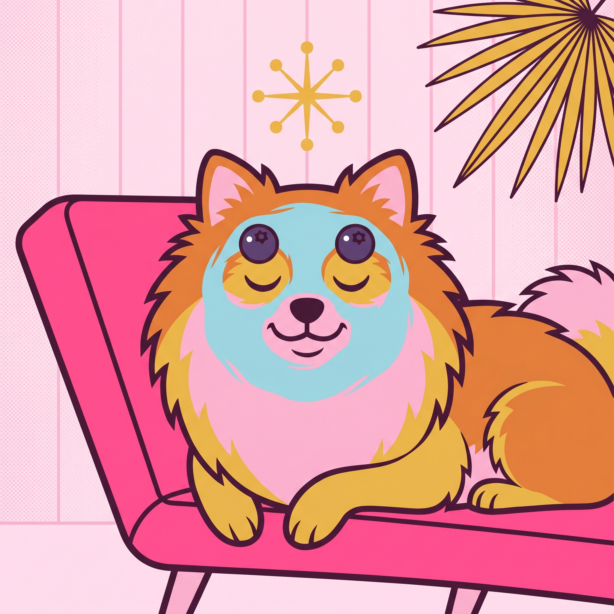
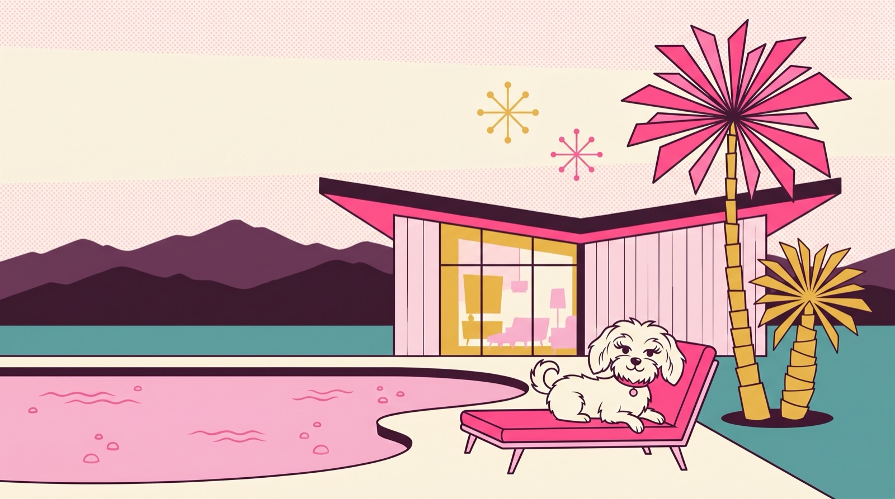
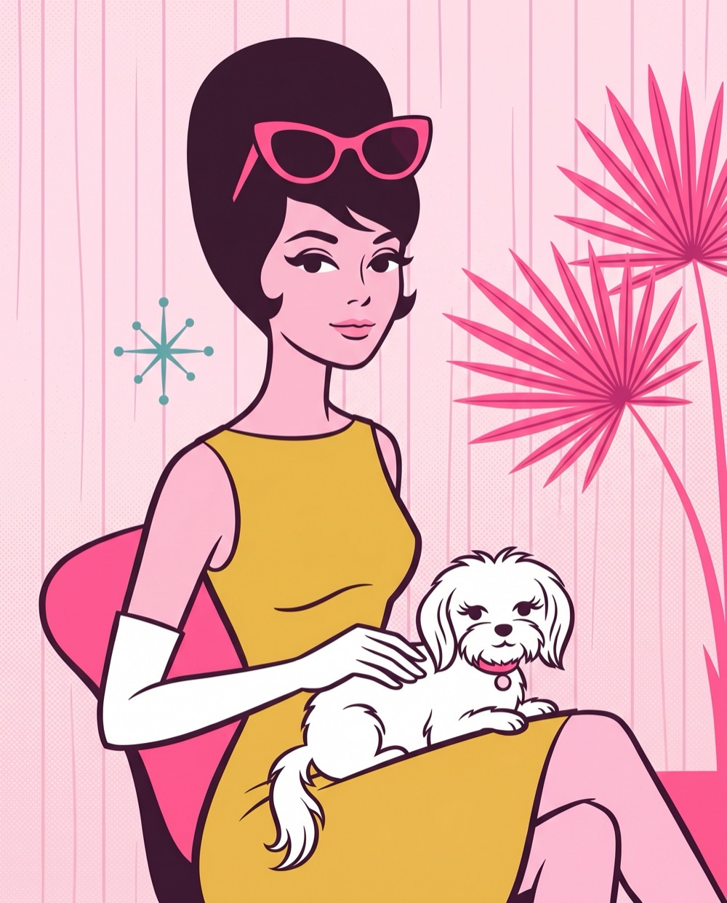
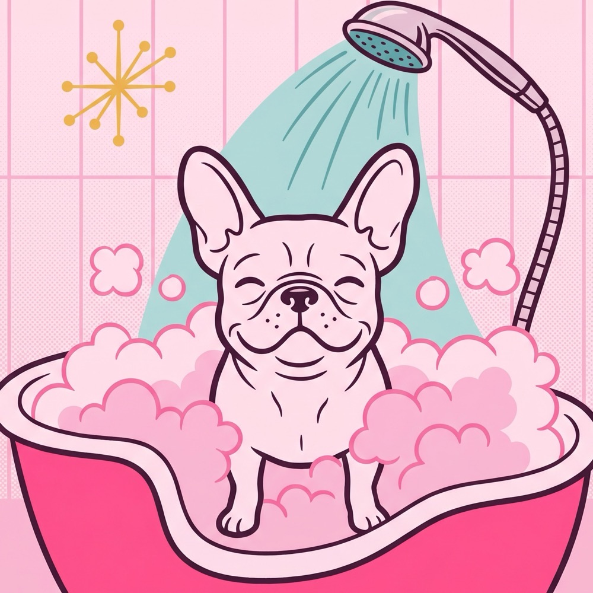
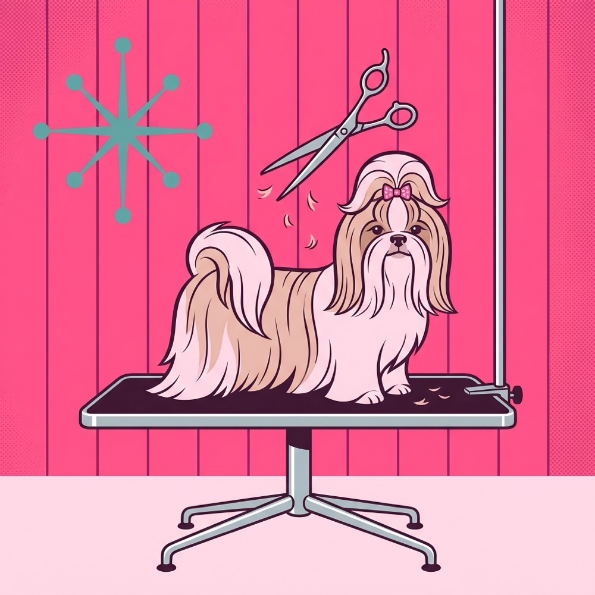
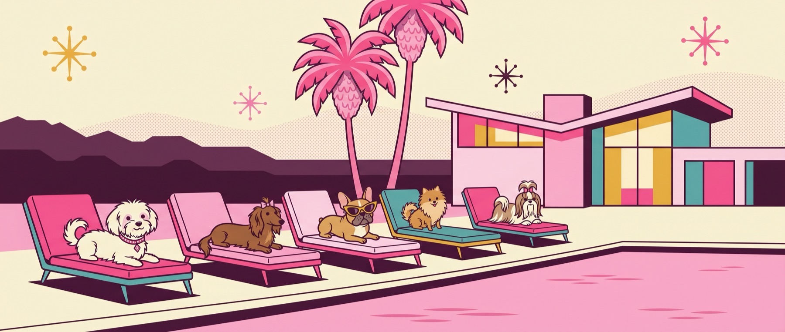
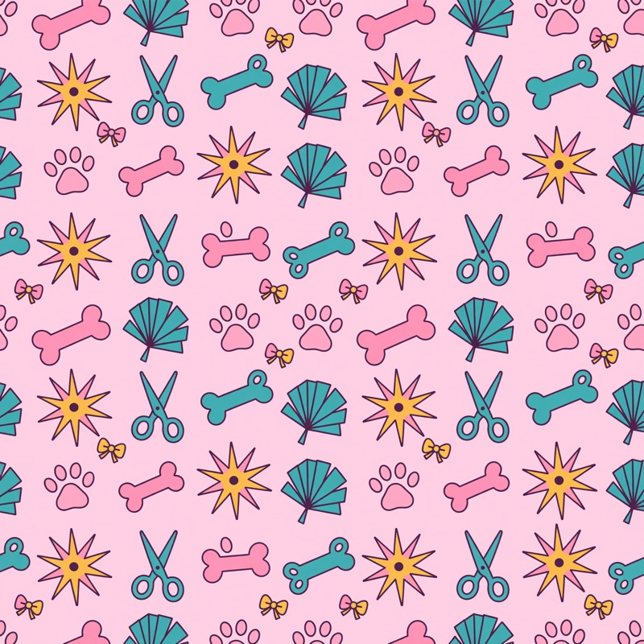
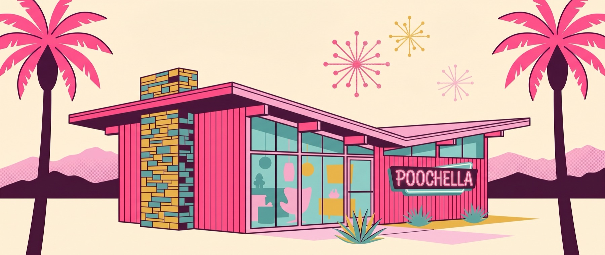

# Image Generation Log — Miriam's Poochella PRO-MAX

## Refit pass (2026-05-15) — added entry #9 and compression notes

All 8 in-use illustrations resized to display dimensions and re-encoded at JPEG quality 82. Body image weight **18.92 MB → 2.47 MB**. All originals backed up to `/tmp/poochella-backup/`.

- Hero 2752×1536 → 1600 wide (276 KB)
- Miriam portrait 1856×2304 → 1000 wide (255 KB)
- Hydrobath 2048×1680 → cropped to 1680 square → 1000 (221 KB)
- Fullgroom 2048×2048 → 1000 (184 KB)
- VIP banner 3168×1344 → 1800 wide (258 KB)
- Exterior banner 3168×1344 → 1800 wide (253 KB)
- Pattern 2048×2048 → 800 (229 KB)
- Facial (v2) 2048×2048 → 1000 (198 KB) — see #9 below

OG image (1200×630, 176 KB) regenerated from the new compressed hero.

---

### #9 — service-facial.jpg (Nano Banana Pro 2K — REFIT regen, replaces v1)

- **Timestamp**: 2026-05-15 12:09
- **Tier**: 2 | **API**: Gemini Nano Banana Pro 2K | **Cost**: $0.134
- **Exec Time**: 33s
- **Reason for regen**: v1 rendered the "blueberry on eye" concept ambiguously — one eye open winking, one closed with a starburst-decal-looking thing instead of a clear blueberry. Audit pass flagged it. v2 prompt emphasized "BOTH EYES FULLY CLOSED" and "two round whole fresh blueberries clearly visible as cucumber-spa-style eye decorations".
- **Aspect ratio**: 1:1
- **Claude Review**: Use Case 10/10 | Prompt Accuracy 10/10 — both eyes closed in a serene smile, two clear round blueberries on the eyelids, blue facial mask wrapped around the face, sun-mustard atomic starburst, mustard fan palm peeking in.
- **Status**: ✓ Used (replaced v1)
- **Attempts**: 1/2
- **v1**: archived to `service-facial-v1-rejected.jpg` (no-delete rule)

---

## Refit cost: $0.134 — running total $1.65 + $0.134 = **$1.78**

All 8 illustrations generated 2026-05-15. Style: Shag (Josh Agle) flat-vector mid-century atomic Palm Springs, pink-forward. Strict 6-color palette: `#FF4D8C` cabana pink, `#FBB6CE` bubblegum, `#FFE0EC` powder pink, `#5BA3A3` pool teal, `#E8B946` sun mustard, `#3D1830` plum ink.

Pre-build approval: Zack signed off on all 14 (PRO-MAX + FRONTEND-FX) via [click-to-tag selection page](https://banana-daddy.github.io/miriams-poochella-select/) — all marked USE.

---

### #1 — hero.jpg (Nano Banana Pro 2K — hero slot)

- **Timestamp**: 2026-05-15 10:44
- **Tier**: 2 | **API**: Gemini Nano Banana Pro 2K | **Cost**: $0.134
- **Exec Time**: 28s
- **Slot**: Full-bleed 16:9 hero
- **Aspect ratio**: 16:9
- **Prompt**: Shag-style flat vector. Fluffy white Maltese (with floppy ears, eyelashes, pink rhinestone collar) lounging on a hot-pink mid-century chaise beside a kidney-shaped pool with bubblegum-pink water. Hot-pink + mustard fan palms, butterfly-roof MCM house with glowing windows, two atomic starbursts in the warm cream sky, plum mountain silhouettes. Strict 6-color palette enforced. Generous negative space upper-left for typography overlay.
- **Claude Review**: Use Case 9/10 | Prompt Accuracy 9/10
- **Status**: ✓ Used + cropped to OG 1200×630
- **Attempts**: 1/2 (first try)

---

### #2 — miriam-portrait.jpg (Nano Banana Pro 2K)

- **Timestamp**: 2026-05-15 10:45
- **Tier**: 2 | **API**: Gemini Nano Banana Pro 2K | **Cost**: $0.134
- **Exec Time**: 26s
- **Slot**: About section portrait (4:5)
- **Aspect ratio**: 4:5
- **Prompt**: Shag-style 4:5 portrait. Chic European woman with tall sculpted dark beehive, cabana-pink cat-eye sunglasses pushed up, sun-mustard A-line cocktail dress, white opera gloves. Holding the fluffy white Maltese mascot in her lap. Pale-pink vertical wood-slat wall background with one stylized hot-pink fan palm.
- **Claude Review**: Use Case 9/10 | Prompt Accuracy 9/10
- **Status**: ✓ Used
- **Attempts**: 1/2

---

### #3 — service-hydrobath.jpg (Nano Banana 2 2K, retry after timeout)

- **Timestamp**: 2026-05-15 10:52
- **Tier**: 2 | **API**: Gemini Nano Banana 2 2K | **Cost**: $0.101 (charged) + $0.101 likely-charged timeout = $0.202 total slot cost
- **Exec Time**: 105s (retry); first attempt timed out at 240s with no response
- **Slot**: Hydro Bath service card (1:1)
- **Aspect ratio**: 1:1
- **Prompt**: Shag-style. French Bulldog (bat ears) in a kidney-shaped grooming tub surrounded by pink foamy bubbles. Chrome shower wand spraying a soft arc of pool-teal water. Closed-eye pleased expression. Vertical pale-pink tile wall. Atomic starburst in sun mustard.
- **Claude Review**: Use Case 8/10 | Prompt Accuracy 8/10 (palette swatch strip artifact at bottom — cropped in post)
- **Post-processing**: Cropped from 2048×2048 to 2048×1680 to remove the AI-included palette swatch strip at the bottom of the image
- **Status**: ✓ Used (cropped)
- **Attempts**: 1/2 (NB2 first attempt timed out → 2nd NB2 succeeded; counted as 1 successful generation, 1 wasted attempt)

---

### #4 — service-facial.jpg (Nano Banana 2 2K)

- **Timestamp**: 2026-05-15 11:00
- **Tier**: 2 | **API**: Gemini Nano Banana 2 2K | **Cost**: $0.101
- **Exec Time**: 444s (NB2 was slow this run)
- **Slot**: Blueberry Facial service card (1:1)
- **Aspect ratio**: 1:1
- **Prompt**: Shag-style. Pomeranian with reddish-orange fluffy fur on a hot-pink chaise, serene closed-eye expression, blue cosmetic facial mask across face, two whole blueberries on the closed eyes. Sun-mustard atomic starburst. Pale-pink vertical wood-slat wall with mustard fan-palm frond peeking in.
- **Claude Review**: Use Case 7/10 | Prompt Accuracy 7/10 — the "blueberry on eye" rendered ambiguously (one eye open winking, one closed with a starburst-decal); Zack noted in selection feedback but approved as USE
- **Status**: ✓ Used (Zack approved)
- **Attempts**: 1/2

---

### #5 — service-fullgroom.jpg (Nano Banana 2 2K)

- **Timestamp**: 2026-05-15 11:02
- **Tier**: 2 | **API**: Gemini Nano Banana 2 2K | **Cost**: $0.101
- **Exec Time**: 96s
- **Slot**: Bath & Full Groom service card (1:1)
- **Aspect ratio**: 1:1
- **Prompt**: Shag-style. Long-haired Shih Tzu with a topknot + pink rhinestone bow on a chrome mid-century grooming table with chrome pedestal. Chrome scissors floating above mid-snip with tiny fur clippings falling. Hot-pink vertical wood-slat wall + pool-teal atomic starburst upper-left.
- **Claude Review**: Use Case 9/10 | Prompt Accuracy 9/10
- **Status**: ✓ Used
- **Attempts**: 1/2

---

### #6 — vip-banner.jpg (Nano Banana Pro 2K)

- **Timestamp**: 2026-05-15 11:03
- **Tier**: 2 | **API**: Gemini Nano Banana Pro 2K | **Cost**: $0.134
- **Exec Time**: 29s
- **Slot**: VIP gallery banner (21:9 ultra-wide)
- **Aspect ratio**: 21:9
- **Prompt**: Shag-style ultra-wide. Five different dogs reclining on five different colored chaises poolside (Maltese on cabana pink, Dachshund on bubblegum, Frenchie with sun-mustard cat-eye sunglasses on powder pink, Pomeranian on pool teal, Shih Tzu on cabana pink). Pink pool, two hot-pink fan palms, butterfly-roof MCM house with glowing windows, three atomic starbursts, plum mountain silhouettes.
- **Claude Review**: Use Case 10/10 | Prompt Accuracy 10/10 — MVP of the set
- **Status**: ✓ Used
- **Attempts**: 1/2

---

### #7 — pattern-atomic.jpg (Grok Standard 2K)

- **Timestamp**: 2026-05-15 11:04
- **Tier**: 1 | **API**: Grok Standard 2K | **Cost**: $0.02
- **Exec Time**: 15s
- **Slot**: Repeating background for the "House Rule" section
- **Aspect ratio**: 1:1
- **Prompt**: Tile-ready repeating pattern on powder-pink. Stylized dog bones, scissor pairs, paw prints, atomic six-point starburst flowers, fan-palm fronds, tiny grooming bows. Strict 6-color palette.
- **Claude Review**: Use Case 9/10 | Prompt Accuracy 9/10
- **Status**: ✓ Used
- **Attempts**: 1/2

---

### #8 — exterior-banner.jpg (Nano Banana Pro 2K)

- **Timestamp**: 2026-05-15 11:05
- **Tier**: 2 | **API**: Gemini Nano Banana Pro 2K | **Cost**: $0.134
- **Exec Time**: 30s
- **Slot**: Salon exterior banner (21:9 ultra-wide) above visit section
- **Aspect ratio**: 21:9
- **Prompt**: Shag-style ultra-wide. Hot-pink-walled mid-century-modern butterfly-roof building with stacked-stone chimney column, large floor-to-ceiling windows showing interior salon furniture glowing softly. Vintage neon-style "POOCHELLA" sign in cabana-pink with pool-teal under-glow. Two tall hot-pink fan palms framing. Mustard agave plant in front. Three atomic starbursts in warm cream sky, plum mountain silhouettes.
- **Claude Review**: Use Case 10/10 | Prompt Accuracy 9/10
- **Status**: ✓ Used
- **Attempts**: 1/2

---

## Cost Summary

| Action | Model | Count | Subtotal |
|---|---|---|---|
| Generate | Nano Banana Pro 2K | 4 (hero, miriam, vip-banner, exterior) | $0.536 |
| Generate | Nano Banana 2 2K | 3 (hydrobath × 2 incl timeout, facial, fullgroom) | $0.404 |
| Generate | Grok Standard 2K | 1 (pattern) | $0.020 |
| OG processing | sips | 1 | $0.00 |
| QA | Grok vision | 0 (Claude review only per Zack approval) | $0.00 |
| **PRO-MAX TOTAL** | | **8 images** | **$0.96** |

Within $2.00 expected / $3.00 ceiling. The single timed-out NB2 call cost an extra ~$0.10 but server-side generation likely completed even though the response didn't return in time — Gemini's typical billing behavior.

## Per-image attempt counter

All 8 images succeeded on attempt 1/2. No escalations to higher tier required. No QA-driven retries (skipped Grok vision QA on Zack's direct approval of all 14 illustrations via the selection page).
